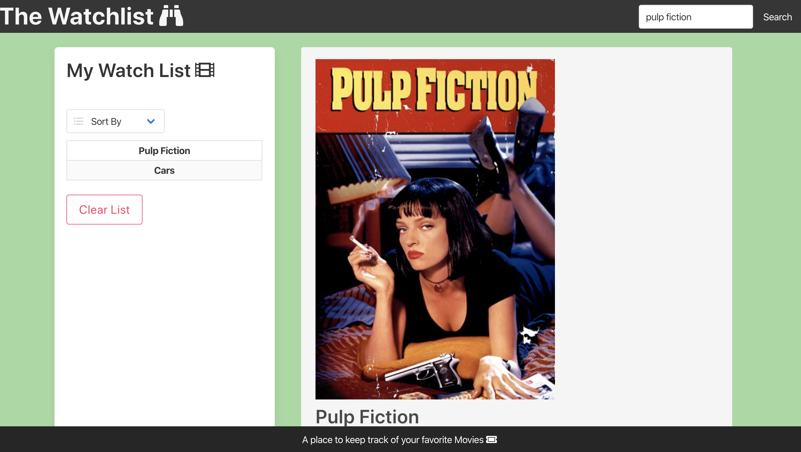
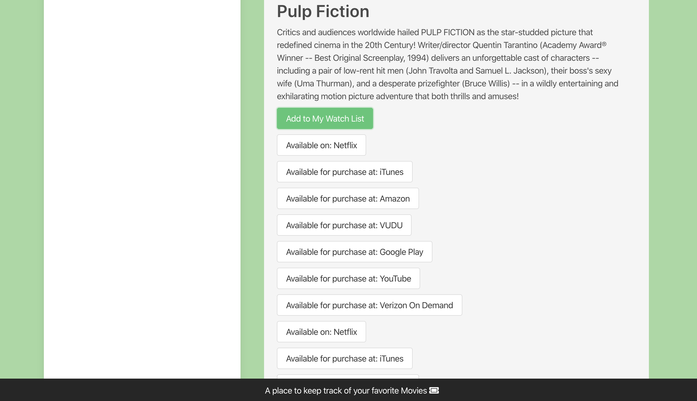
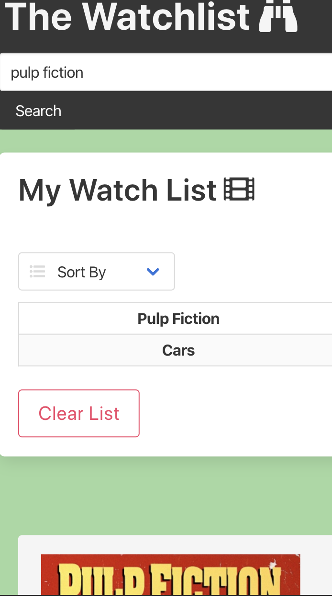
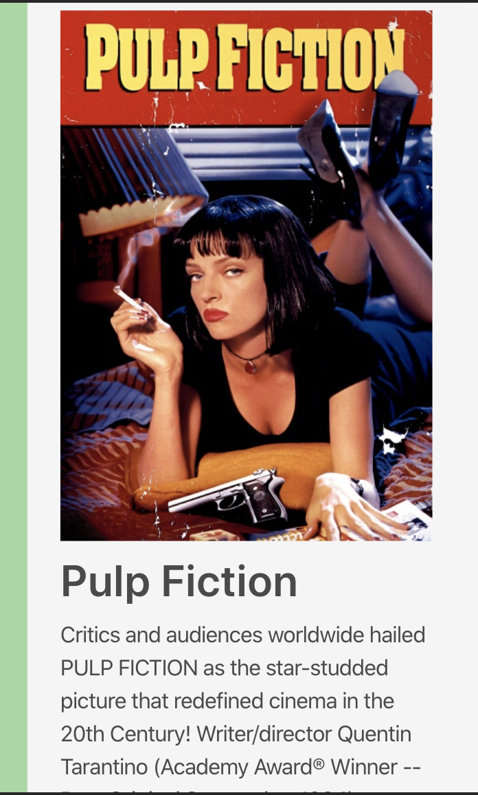
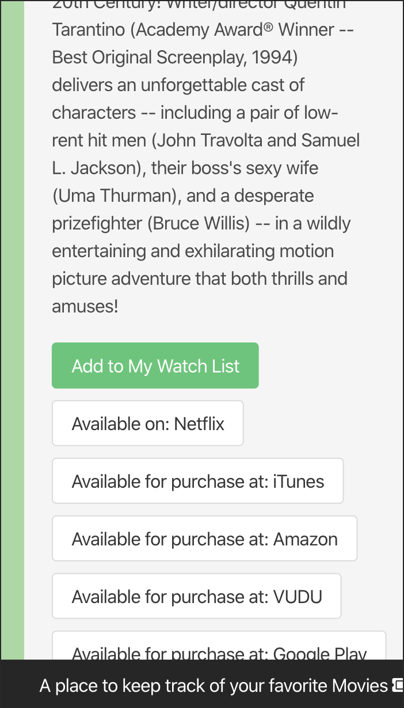

# The Watch List

<br>

# Summary

This is a website that can be used to keep track of a "Watch List" of movies. The user can search a movie, then decide to add the movie to their Watch List, which is stored in Local Storage. In addition, there are buttons that will link to services on which the movie is available on (Netflix, Amazon, etc). Finally, if the movie searched for is currently in theaters, the site will provide a map with local theaters.
<br>

# Sample Images

Home Screen

<br>
<br>

Mobile
<br>
<br>

<br>

<br>


# Technologies

- HTML - used to create elements on the DOM
- CSS - styles html elements on page.
- Bulma - Used to create cosmitics of the website and the layout.
- Chroma.js - Used for changing the color of the background.
- Jquery - to create the edits in the website
- GuideBox API - pull informaition about the movie titles and where to buy them.
- Google Maps Api - Find theaters near you.
- Ajax - to pull information from
- Fontawesome - made icons in html
- Git - version control system to track changes to source code
- GitHub - hosts repository that can be deployed to GitHub Pages

# Authors

Micheal:[LinkedIn](https://www.linkedin.com/in/michael-partin-49ba1081/)
[GitHub](https://github.com/rev1311)
Arman:[LinkedIn](https://www.linkedin.com/in/arman-riahi/)
[GitHub](https://github.com/namrataffy)
Andres:[LinkedIn](linkedin.com/in/andres-felipe-jimenez-ferreira-b67a35192)
[GitHub](https://github.com/AndresF97)

# Code Snippet

Code showing embedded API calls:

```

var queryURL =
    "https://api-public.guidebox.com/v2/search?type=movie&field=title&query=" +
    currentMovie +
    "&api_key=423737429793de8dc8210f09410b7509920f90d7";
  $.ajax({
    url: queryURL,
    method: "GET"
  }).then(function(response) {
    console.log(response);
    var currentMovieID = response.results[0].id;

    var queryURL =
      "https://api-public.guidebox.com/v2/movies/" +
      currentMovieID +
      "?api_key=423737429793de8dc8210f09410b7509920f90d7";
    $.ajax({
      url: queryURL,
      method: "GET"
    }).then(function(response) {
      console.log(response);

```
